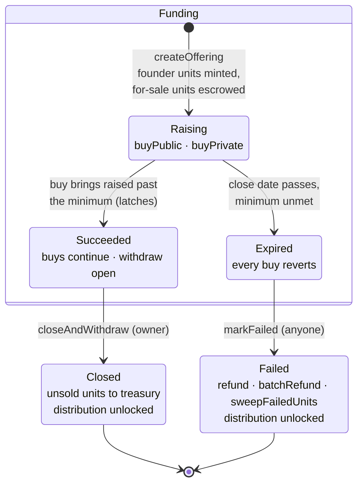

# PACT — Contract Specification

## Overview

Each raise is its own pair of contracts on Base, deployed together:

- [`OfferingFactory`](../src/OfferingFactory.sol) deploys and wires one
  `Offering` + `PactToken` pair per raise.
- [`Offering`](../src/Offering.sol) escrows the for-sale units, prices them
  along a linear curve in two tranches, holds the deposited USDC, and runs
  the lifecycle.
- [`PactToken`](../src/PactToken.sol) is the cap table: an ERC-1155 with
  exactly 1,000 units of token id 0, built on the vendored 0xSplits
  LiquidSplit base ([`src/vendor`](../src/vendor)).

## PactToken

The cap table is a [liquid split](https://splits.org/protocol/docs/templates/liquid): revenue sent to the token (ETH or ERC-20)
is distributable to holders in proportion to their units via [Splits](https://splits.org/protocol/docs/core/split).

- **The token never holds its own units.** The constructor rejects a
  holder equal to the token itself.
- **Units are freely transferable at all times**, including mid-raise.
- **Distribution is locked while the offering is Funding.** The curve
  prices units off units sold alone, so a mid-raise distribution would let
  a buyer purchase units blind to banked revenue and capture it
  atomically. Once the offering is Closed or Failed, `distributeFunds` is
  permissionless as usual. Accepted residual: after a failure, revenue
  accrued before the failure stays distributable by holders who have not
  yet refunded.
- **Revenue goes to the token, never to `payoutSplit`.** The LiquidSplit
  base creates the payout split with placeholder recipients
  (`address(0)` and `address(1)`, 50/50) that only the first
  `distributeFunds` rewrites; upstream that happens moments later, here the
  Funding lock keeps the placeholder live for the whole raise. SplitMain's
  own `distributeETH`/`distributeERC20` are permissionless against the
  stored recipients, so anything sent straight to `payoutSplit` before the
  first distribution can be pushed to the placeholders and lost. The same
  holds between distributions for the last-written holder set.
- **Distribution takes the holder list from the caller**, and the split
  update requires the percentages to sum to 100% — an incomplete list
  fails to update the split and the pushed funds wait in the payout split
  until a complete call succeeds.
- **Distribution has a holder-count ceiling of roughly 650.**
  `distributeFunds` needs the complete holder list in a single
  transaction and costs ~25k gas per listed holder against SplitMain
  (measured on a Base mainnet fork with every recipient slot cold: 12.6M
  gas at 500 holders, 25.2M at 1,000). Base caps a transaction at
  16,777,216 gas ([EIP-7825](https://docs.base.org/base-chain/network-information/throughput-and-limits), Azul hardfork), so a distribution
  stops fitting somewhere around 650 holders — while the 1-unit minimum
  permits up to 1,000. A cap table fragmented past the ceiling cannot
  distribute (pushed funds wait in the token, and nothing else breaks)
  until transfers consolidate holdings back under it.
- **Metadata is fully onchain**: `uri` returns a data URI embedding the
  project name and a rendered SVG.

## Pricing

One linear curve prices both tranches; there is no second price. Unit *n*
(counting all units sold, both tranches, from zero) costs
`priceStart + priceSlope · n`. Buying `units` at curve position `sold`
therefore costs:

```text
costFor(sold, units) = units · priceStart
                     + priceSlope · (sold · units + units · (units − 1) / 2)
```

Buying N units in one call costs exactly the same as N single-unit buys;
the arithmetic is exact and never truncates. A quote for zero units is
zero.

The curve position (`unitsSold`) is monotone: refunds return units to
escrow but never rewind the curve, so a post-refund buyer pays the
position's price, not the original buyer's.

Every buy is slippage-bounded by a caller-supplied maximum cost and
reverts above it.

## Tranches

The curve splits into a public tranche and a private one.

- **Public** buys are permissionless up to `publicUnits`, a cap the issuer
  can adjust.
- **Private** claims cannot consume the unsold public reservation: a claim
  is limited to escrowed units in excess of `publicUnits − publicUnitsSold`.
  The advertised public cap is therefore always deliverable.
- The cap itself is bounded from both sides: it can never drop below what
  the public tranche already sold, and never exceed what the escrow can
  still deliver. Enlarging the private side requires lowering the public
  cap first.

## Allocations

A private allocation is authorized by two EIP-712 signatures under the
offering's own domain.

1. **The voucher**, signed by the offering's owner:
   `Voucher(bytes32 allocationId, string buyerName, uint256 amountCapUsdc,
   address linkKey)`. It endorses a throwaway link key; the signature is
   verified against the live owner with ERC-1271 support, so a
   contract-wallet issuer works.
2. **The claim**, signed by the link key (plain ECDSA):
   `Claim(bytes32 allocationId, address buyer)`, where the buyer is the
   claiming caller.

Allocation semantics:

- **Caps dollars, not price.** The claim buys at the live curve position;
  the cost is checked against `amountCapUsdc` after the buy and reverts if
  exceeded.
- **One-shot, no expiry.** A single consumed flag per allocation id covers
  both a completed claim and an issuer cancellation.
- **Ownership rotation mass-revokes.** Because vouchers verify against the
  live owner, any ownership change invalidates every
  outstanding link. Conversely, ownership returning to a previous owner
  (A→B→A) revives that owner's unclaimed vouchers — rotation is not a
  substitute for cancelling a specific allocation.

Every purchase, public or private, emits `Bought` carrying the buyer's
display name and the allocation id (zero for public buys).

## Lifecycle



Exact conditions:

- **Buys** require state Funding and revert once the close date has passed
  while the minimum is unmet. Once `minMet` latches, the close date no
  longer restricts buying.
- **The minimum latch** sets the moment cumulative deposits reach
  `raiseMin`, and never unsets. A raise that meets its minimum can never
  become refundable.
- **Withdrawal** requires only the latch: permissionless, callable while
  Funding or Closed, and pays the treasury regardless of caller — so
  triggering it grants no one anything.
- **Closing** is owner-only and requires the latch; it has no timing
  requirement in either direction — the issuer may close before the close
  date, or never, in which case a Succeeded offering keeps funding
  forever. Closing withdraws remaining proceeds and returns unsold units
  to the treasury.
- **Failure declaration** is permissionless and requires all three: state
  Funding, the close date passed, and the minimum unmet. Nothing forces
  it, so an Expired offering can sit unlabeled indefinitely.

In Failed:

- **Self-refund** pays a buyer only if their full purchased units come
  back to escrow in the same call. A buyer holding fewer units than they
  bought forfeits (see [Accepted trade-offs](#accepted-trade-offs)).
- **Batch refund** is owner-only: a buyer with nothing to refund is passed
  over silently, a buyer whose units are missing is skipped with an event,
  and a failing USDC transfer (e.g. a blocklisted buyer) reverts the whole
  batch.
- **The sweep** is permissionless and repeatable: it returns all
  escrow-held units (unsold plus reclaimed) to the treasury, reverting the
  cap table to the founders.

## Invariants

The code must uphold these at all times; the fuzzing campaign
([`PROPERTIES.md`](../../PROPERTIES.md)) asserts them mechanically.

- **Buyer liability is `raised − withdrawn`**, where `raised` decrements
  on refund. Deposits are reachable by no one except the buyers they
  belong to: withdrawal and closing move only non-liability proceeds to
  the treasury, the excess-USDC sweep moves only balance above liability
  (split revenue can be pushed in by third parties), and rescue rejects
  USDC and the cap-table token outright. A forfeited or undeliverable
  deposit stays counted as liability forever.
- **Total token supply is exactly 1,000** — no mint after construction, no
  burn path.
- **The curve position never decreases**, and the public tranche
  invariants hold across cap adjustments: units sold publicly never exceed
  the cap, and the cap never exceeds deliverable escrow.
- **Only the owner moves ownership** — by direct transfer, by renounce,
  or by completing a two-step handover the incoming owner requested
  (requests expire after 48 hours).

## Accepted trade-offs

- **The issuer can self-fund the minimum, then withdraw.** Any
  issuer-keyed restriction is trivially defeated with a fresh wallet, and
  delaying withdrawals to the close date degrades the honest product
  without closing the hole. The minimum is a coordination signal, not a
  trustless guarantee (see the
  [trust model](../../docs/architecture.md#trust-model)).
- **The treasury is re-pointable mid-raise.** This grants the issuer no
  power they lack — the issuer is the party being funded, and proceeds go
  to the treasury either way.
- **A buyer who moved units forfeits their refund.** Paying partial
  refunds would let a buyer sell units elsewhere and still recover their
  deposit. The forfeited deposit stays counted as buyer liability
  ([Invariants](#invariants)).
- **A failed-raise sweep can collapse the cap table to one holder.** If
  the sweep lands all 1,000 units on a single address, distribution
  reverts until any one unit moves.
- **Stray NFTs are unrecoverable.** `rescue` moves only ERC-20s and ETH;
  an ERC-721 or ERC-1155 sent to the escrow by mistake is stuck.
