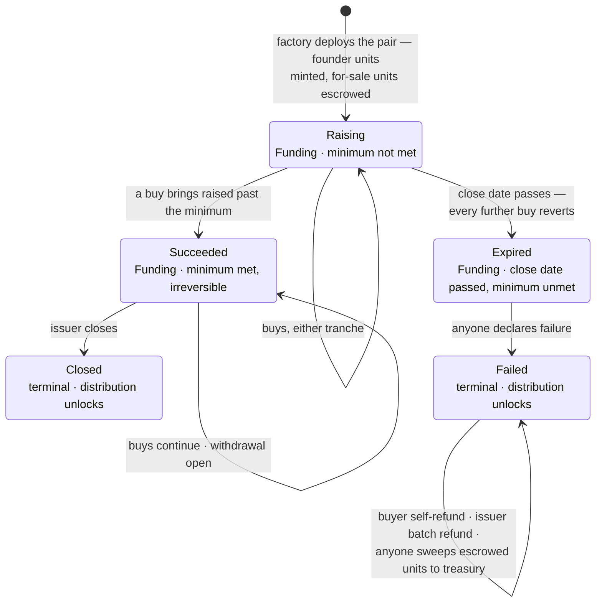

# PACT — Contract Specification

This document specifies the contract layer. It is the source of truth: the
code must match what is written here, and a mismatch is a bug in one of the
two. System-level context and vocabulary live in
[docs/architecture.md](../../docs/architecture.md).

## Overview

Each raise is its own pair of contracts on Base, deployed together:

- [`OfferingFactory`](../src/OfferingFactory.sol) deploys and wires one
  `Offering` + `PactToken` pair per raise. It holds no state beyond the
  SplitMain address and keeps no registry.
- [`Offering`](../src/Offering.sol) escrows the for-sale units, prices them
  along a linear curve in two tranches, holds the deposited USDC, and runs
  the lifecycle.
- [`PactToken`](../src/PactToken.sol) is the cap table: an ERC-1155 with
  exactly 1,000 units of token id 0, built on the vendored 0xSplits
  LiquidSplit base ([`src/vendor`](../src/vendor)), so units are live
  claims on revenue.

The only payment token is USDC, hardcoded to the Base mainnet address;
the contracts are Base-specific.

## OfferingFactory

The factory is a pure deployer: permissionless, no owner, no registry.
`createOffering` performs, in order:

1. Rejects a zero treasury. The treasury address becomes both the
   offering's `treasury` and its initial `owner`; the two can diverge
   later.
2. Rejects an invalid cap table: an empty holder list, a length mismatch
   between holders and allocations, a zero-address holder, a holder equal
   to the offering, a zero allocation entry, or zero offered units.
3. Rejects `publicUnits` greater than the offered units.
4. Deploys the `Offering`, whose constructor independently requires a
   close date in the future and a nonzero starting price.
5. Rejects an unreachable minimum: `raiseMin` must not exceed
   `costFor(0, offeringUnits)` — the proceeds of selling every offered
   unit. No offering can exist whose success is arithmetically impossible.
6. Deploys the `PactToken`, which mints founder units to the holders, the
   for-sale units directly into the offering's escrow, and enforces that
   the total is exactly 1,000.
7. Binds the pair (`initialize`, callable only by the factory, only once)
   and emits `OfferingCreated`.

The transaction is all-or-nothing: a failure at any step leaves no partial
pair behind. `OfferingCreated` carries the complete listing payload —
issuer, treasury, both contract addresses, project name, curve parameters,
minimum, close date, and the public cap — because the event log is the
only discovery mechanism.

## PactToken

The cap table is a liquid split: revenue sent to the token (ETH or ERC-20)
is distributable to holders in proportion to their units via the 0xSplits
split the token controls. One unit is 0.1% ownership.

- **Supply is exactly 1,000, forever.** There is no burn path anywhere in
  the codebase, and the constructor rejects any configuration that does
  not sum to 1,000. Split distribution math tolerates no holes in the cap
  table.
- **The token never holds its own units.** The constructor rejects a
  holder equal to the token itself — self-held units would recirculate
  their own split share forever.
- **The offering is a permanent, hardwired operator** on every holder's
  balance. This is what lets a refund reclaim a buyer's units without a
  buyer approval transaction. The approval is implicit: no `ApprovalForAll`
  event is ever emitted for it, so indexers relying on approval events
  alone will not see it, and it cannot be revoked.
- **Units are freely transferable at all times**, including mid-raise.
  This is what makes refund forfeiture (below) a reachable state.
- **Distribution is locked while the offering is Funding.** The curve
  prices units off units sold alone, so a mid-raise distribution would let
  a buyer purchase units blind to banked revenue and capture it
  atomically. Once the offering is Closed or Failed, `distributeFunds` is
  permissionless as usual. Accepted residual: after a failure, revenue
  accrued before the failure stays distributable by holders who have not
  yet refunded.
- **Distribution takes the holder list from the caller**, and the split
  update requires the percentages to sum to 100% — an incomplete list
  fails to update the split and the pushed funds wait in the payout split
  until a complete call succeeds.
- **Metadata is fully onchain**: `uri` returns a data URI embedding the
  project name and a rendered SVG, identical for every token id, so
  wallets display the project without any server.

## Pricing

One linear curve prices both tranches; there is no second price. Unit *n*
(counting all units sold, both tranches, from zero) costs
`priceStart + priceSlope · n`. Buying `units` at curve position `sold`
therefore costs:

```text
costFor(sold, units) = units · priceStart
                     + priceSlope · (sold · units + units · (units − 1) / 2)
```

The arithmetic is exact: `units · (units − 1)` is a product of consecutive
integers, so the halving never truncates. Buying N units in one call costs
exactly the same as N single-unit buys; the curve has no rounding surface.
A quote for zero units is zero.

The curve position (`unitsSold`) is monotone: refunds return units to
escrow but never rewind the curve, so a post-refund buyer pays the
position's price, not the original buyer's.

Every buy is slippage-bounded by a caller-supplied maximum cost and
reverts above it.

## Tranches

The curve splits into a public tranche and a private one.

- **Public** buys are permissionless up to `publicUnits`, a cap the issuer
  can adjust. `publicUnitsSold` can never exceed it.
- **Private** claims cannot consume the unsold public reservation: a claim
  is limited to escrowed units in excess of `publicUnits − publicUnitsSold`.
  The advertised public cap is therefore always deliverable.
- The cap itself is bounded from both sides: it can never drop below what
  the public tranche already sold, and never exceed what the escrow can
  still deliver. Enlarging the private side requires lowering the public
  cap first.

## Allocations

A private allocation is authorized by two EIP-712 signatures under the
offering's own domain (name `PACT`, version `1`, bound to the chain id and
the offering address — so nothing replays against any other deployment,
including a same-address twin on another chain).

1. **The voucher**, signed by the offering's owner:
   `Voucher(bytes32 allocationId, string buyerName, uint256 amountCapUsdc,
   address linkKey)`. It endorses a throwaway link key; the signature is
   verified against the live owner with ERC-1271 support, so a
   contract-wallet issuer works.
2. **The claim**, signed by the link key (plain ECDSA):
   `Claim(bytes32 allocationId, address buyer)`, where the buyer is the
   claiming caller. The link key travels in the allocation link's URL
   fragment; possession of the link is the sole capability, and a claim
   observed in the mempool cannot be redirected because the buyer's
   address is already signed.

Allocation semantics:

- **Caps dollars, not price.** The claim buys at the live curve position;
  the cost is checked against `amountCapUsdc` after the buy and reverts if
  exceeded — it never clamps. Nothing signed pins a curve position,
  because a pinned price would let a stale allocation jump the curve ahead
  of live buyers.
- **One-shot, no expiry.** A single consumed flag per allocation id covers
  both a completed claim and an issuer cancellation.
- **Ownership rotation mass-revokes.** Because vouchers verify against the
  live owner, completing an ownership transfer invalidates every
  outstanding link — the intended default under key compromise, since
  re-issuing links costs nothing.

Every purchase, public or private, emits `Bought` carrying the buyer's
display name and the allocation id (zero for public buys). Purchases
render everywhere from these events; nothing is stored for display.

## Lifecycle

The offering has three onchain states — Funding, Closed, Failed — and two
more facts split Funding into three phases: the minimum latch and the
close date.



Exact conditions:

- **Buys** require state Funding and revert once the close date has passed
  while the minimum is unmet. Once `minMet` latches, the close date no
  longer restricts buying.
- **The minimum latch** sets the moment cumulative deposits reach
  `raiseMin`, and never unsets. A raise that meets its minimum can never
  become refundable.
- **Withdrawal** requires only the latch: permissionless, callable while
  Funding or Closed, and pays the treasury regardless of caller — so
  triggering it grants no one anything.
- **Closing** is owner-only and requires the latch; it has no timing
  requirement in either direction — the issuer may close before the close
  date, or never, in which case a Succeeded offering keeps funding
  forever. Closing withdraws remaining proceeds and returns unsold units
  to the treasury. Terminal.
- **Failure declaration** is permissionless and requires all three: state
  Funding, the close date passed, and the minimum unmet. Nothing forces
  it, so an Expired offering can sit unlabeled indefinitely. Terminal.

In Failed:

- **Self-refund** pays a buyer only if their full purchased units come
  back to escrow in the same call — the escrow's operator status pulls
  them, units first, USDC second. A buyer holding fewer units than they
  bought forfeits: partial refunds would let a buyer sell units elsewhere
  and still recover their deposit.
- **Batch refund** is owner-only: a buyer with nothing to refund is passed
  over silently, a buyer whose units are missing is skipped with an event,
  and a failing USDC transfer (e.g. a blocklisted buyer) reverts the whole
  batch — the owner retries without that buyer, who keeps the self-serve
  path regardless.
- **The sweep** is permissionless and repeatable: it returns all
  escrow-held units (unsold plus reclaimed) to the treasury, reverting the
  cap table to the founders as refunds trickle in.

## Invariants

The code must uphold these at all times; the fuzzing campaign
([`PROPERTIES.md`](../../PROPERTIES.md)) asserts them mechanically.

- **Buyer liability is `raised − withdrawn`**, where `raised` decrements
  on refund. Deposits are reachable by no one except the buyers they
  belong to: withdrawal and closing move only non-liability proceeds to
  the treasury, the USDC skim moves only balance in excess of liability
  (split revenue can be pushed in by third parties), and rescue rejects
  USDC and the cap-table token outright. A forfeited or undeliverable
  deposit stays counted as liability forever.
- **ETH is never liability.** The offering accepts ETH only so a
  permissionless SplitMain push cannot strand a revenue share; the full
  ETH balance is always rescuable.
- **Total token supply is exactly 1,000** — no mint after construction, no
  burn path.
- **The escrow's operator status is permanent** and not represented in
  approval events.
- **The curve position never decreases**, and the public tranche
  invariants hold across cap adjustments: units sold publicly never exceed
  the cap, and the cap never exceeds deliverable escrow.
- **Ownership moves only by two-step transfer** — a nomination the new
  owner must accept. There is no renounce path.

## Accepted trade-offs

These are deliberate. Each was weighed against its alternative and kept.

- **The issuer can self-fund the minimum, then withdraw.** Any
  issuer-keyed restriction is trivially defeated with a fresh wallet, and
  delaying withdrawals to the close date degrades the honest product
  without closing the hole. The minimum is a coordination signal, not a
  trustless guarantee; PACT's trust model is reputational.
- **The treasury is re-pointable mid-raise.** This grants the issuer no
  power they lack — the issuer is the party being funded, and proceeds go
  to the treasury either way. Re-pointing to a multisig mid-raise is the
  legitimate use.
- **A buyer who moved units forfeits their refund.** Paying partial
  refunds would let a buyer sell units elsewhere and still recover their
  deposit. A forfeited deposit stays counted as buyer liability forever,
  reachable by no one — buyer, issuer, or treasury. That is the price of
  making deposits unstealable.
- **A failed-raise sweep can collapse the cap table to one holder.** If
  the sweep lands all 1,000 units on a single address, distribution
  reverts — the split requires two recipients — until any one unit moves.
  Revenue waits in the payout split meanwhile, retryable. The state is
  issuer-triggered, self-inflicted, and self-healing, so it is documented
  rather than guarded.
