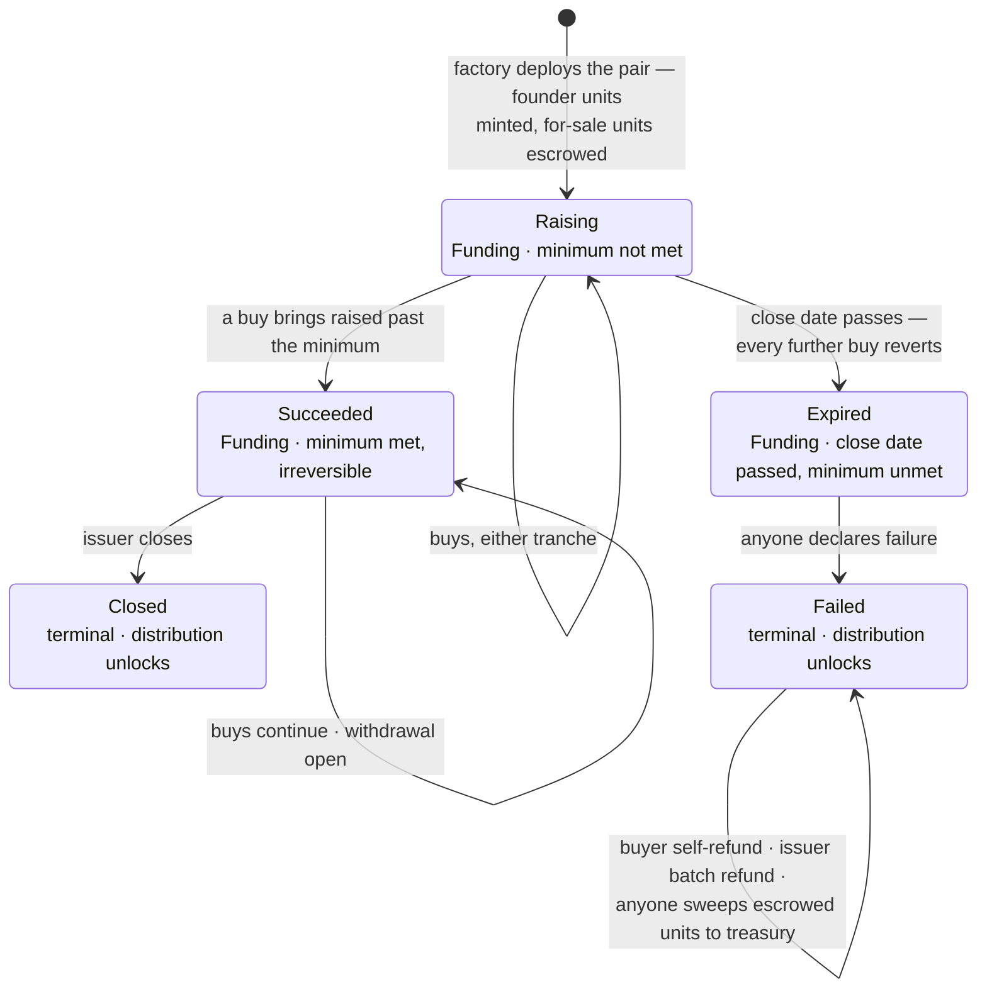

# Contract Design

Each raise is its own pair of contracts on Base: an offering that escrows
and sells units, and a cap-table token that records who owns them. This
document explains how the pair is designed and why, ending with the
trade-offs the design deliberately accepts. Vocabulary is defined in the
[architecture document](architecture.md).

## The cap table

The cap-table token is a liquid split: an ERC-1155 whose 1,000 units of a
single token id are real claims on split proceeds. One unit is 0.1%
ownership. Revenue sent to the split is distributable to holders in
proportion to their units, permissionlessly.

Supply is exactly 1,000, forever. The distribution math tolerates no holes
in the cap table, so no burn path exists anywhere. Creation rejects
configurations that would break this shape — a token minted to itself, or
an account allocated zero units.

Metadata is fully onchain: the token renders its own name and image, so
wallets and marketplaces display the project without any server.

The offering is hardwired as an approved operator of the token. This is
what lets a refund reclaim a buyer's units without a separate approval
transaction from the buyer.

Distribution is locked while the raise is funding. The curve prices units
off units sold alone, so a mid-raise distribution would let a buyer
purchase units blind to banked revenue and capture it atomically. Once the
offering is closed or failed, distribution is permissionless as usual. One
residual is accepted: after a failure, revenue accrued before the failure
stays distributable by holders who have not yet refunded.

## One offering per raise

A factory deploys the pair in a single transaction: the token mints founder
units to the founders and the for-sale units directly into the offering's
escrow, and the offering is initialized against the token. The transaction
is all-or-nothing — a failure at any step leaves no partial pair behind.

The factory keeps no registry. Its creation event carries everything a
listing needs — issuer, treasury, both contract addresses, project name,
curve parameters, minimum, close date, and the public cap — so the event
log is the discovery mechanism. Creation also rejects a minimum the curve
cannot reach, so no offering exists whose success is arithmetically
impossible.

## Pricing and tranches

One linear curve over total units sold prices everything; there is no
second price. The curve splits into two tranches.

The **public tranche** is permissionless up to a cap the issuer can adjust.
The advertised cap is always deliverable: allocation claims cannot consume
the unsold public tranche, and the cap cannot be raised beyond what the
escrow can still deliver. To enlarge the private side, the issuer must
first lower the public cap — a visible, onchain act.

The **private tranche** is everything else, claimable only through
allocations.

## Allocations

An allocation uses two keys. The issuer signs a voucher endorsing a
throwaway link key; the link key travels in the allocation link's URL
fragment and, at claim time, signs the claiming buyer's address. Possession
of the link is therefore the sole capability, and a claim observed in the
mempool cannot be redirected — the buyer's address is already signed in.
Both signatures bind to the specific offering and chain, so neither replays
against any other deployment.

An allocation caps dollars, not price. Purchases between issuance and claim
move the shared curve, so the claimer's units-per-dollar is fixed only at
claim time; the claimer sees the live quote and bounds their cost
themselves. Nothing signed pins a curve position, because a pinned price
would let a stale allocation jump the curve ahead of live buyers.

Allocations are one-shot and never expire. The issuer can revoke one
individually. Voucher verification follows the offering's live ownership —
contract-wallet issuers included — so rotating ownership mass-revokes every
outstanding link. That is the right default under key compromise, since
re-issuing links costs nothing.

Every purchase emits an event carrying the buyer's name and, for claims,
the allocation's identity. Those events are how purchases render
everywhere without a database.

## Lifecycle

The offering has three onchain states — Funding, Closed, Failed — but two
more facts split Funding into three distinct phases: whether the minimum
has been met (an irreversible latch), and whether the close date has
passed. The diagram maps every path.

Every path the diagram encodes:

- **Raising** is where every offering starts. Both tranches sell, and the
  issuer may adjust the public cap and issue or revoke allocations. Two
  exits: a buy reaches the minimum (Succeeded), or the close date passes
  first (Expired).
- **Succeeded** is permanent — the latch never unsets, so an offering that
  reaches its minimum can never fail. Selling continues past the close
  date, anyone may trigger a withdrawal (proceeds can only ever reach the
  treasury, so triggering it grants no one anything), and only from here
  can the issuer close. A Succeeded offering that the issuer never closes
  simply keeps funding forever.
- **Expired** is a dead raise awaiting its label: buys revert, closing is
  impossible (it requires the minimum), and the only move is the
  permissionless failure declaration. Nothing forces it, so an Expired
  offering can sit unlabeled indefinitely — but anyone may end the wait.
- **Closed** ends the sale: remaining proceeds are withdrawn and unsold
  units return to the treasury. Terminal.
- **Failed** unlocks refunds. Terminal, but active: buyers self-refund,
  the issuer may push batch refunds, and anyone may sweep escrowed units
  back to the treasury — each repeatable, in any order.

Revenue distribution follows the state: locked throughout Funding, open in
both terminal states.

Refund semantics: a refund pays out only if the buyer's full purchased
units come back to escrow — a buyer who transferred units away mid-raise
forfeits. In a batch refund, a buyer whose units are missing is skipped and
a buyer whose payout would fail is retried without; every buyer keeps the
self-serve path regardless. The sweep reverts the cap table to the
founders.

Buyer deposits are accounted as a liability: money raised minus money
withdrawn, decremented by refunds. The issuer has recovery paths for stray
tokens and for USDC in excess of that liability (split revenue can be
pushed into the offering by third parties), but the liability itself is
reachable by no one except the buyers it belongs to. Ownership of the
offering transfers only in two steps — a nomination the new owner must
accept.

## Accepted trade-offs

These are deliberate. Each was weighed against its alternative and kept.

- **The issuer can self-fund the minimum, then withdraw** (audit finding
  H-4). Any issuer-keyed restriction is trivially defeated with a fresh
  wallet, and delaying withdrawals to the close date degrades the honest
  product without closing the hole. The minimum is a coordination signal,
  not a trustless guarantee; PACT's trust model is reputational.
- **The treasury is re-pointable mid-raise** (audit finding M-6). This
  grants the issuer no power they lack — the issuer is the party being
  funded, and proceeds go to the treasury either way. Re-pointing to a
  multisig mid-raise is the legitimate use.
- **A buyer who moved units forfeits their refund.** Paying partial refunds
  would let a buyer sell units elsewhere and still recover their deposit.
  A forfeited or undeliverable deposit stays counted as buyer liability
  forever, reachable by no one — buyer, issuer, or treasury. That is the
  price of making deposits unstealable.
- **A failed-raise sweep can collapse the cap table to one holder.** If the
  sweep lands all 1,000 units on a single address, distribution reverts —
  the split requires two recipients — until any one unit moves. Revenue
  waits in the split meanwhile, retryable. The state is issuer-triggered,
  self-inflicted, and self-healing, so it is documented rather than
  guarded (the fuzzing campaign retired this property as an accepted
  violation, GL-20).
